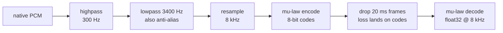

<div align="center">

# handset-bench

**Benchmark text to speech on what survives a G.711 telephone line.**

8 kHz · mu-law · 300-3400 Hz passband · packet loss

[](https://github.com/mahimailabs/handset-bench/actions/workflows/ci.yml)
[](https://pypi.org/project/handset-bench/)
[](https://pypi.org/project/handset-bench/)
[](LICENSE)

</div>

---

Most text to speech is built for 24 kHz headphones and evaluated there. Then it gets
squeezed down a phone line. This measures what that squeeze costs your system.

Bring your own TTS. Bring your own recogniser. Get a word error rate per condition
that you can compare against anyone else's, because the text set, the codec chain and
the scoring rules are all frozen.

```bash
pip install handset-bench
```

## Score your own system

The only thing you implement is `synthesize`. No GPU, no cloud account, no corpus
download.

```python
from handset_bench.conditions import resolve
from handset_bench.runner import run_quality
from handset_bench.textset import loader


class MyTTS:
    def version_string(self):
        return "mytts-0.1"  # pinned identity, appears on the scorecard

    def synthesize(self, text, *, voice=None): ...  # return a SynthResult


utterances = loader.sample(loader.load(), 60)  # spread across all six categories

for name in ("wideband", "clean", "loss_1pct", "loss_3pct"):
    record = run_quality(
        MyTTS(),
        system="mytts",
        asr=MyASR(),  # anything with .transcribe(pcm, sample_rate)
        utterances=utterances,
        condition=resolve(name),
    )
    print(name, record.aggregate["wer"])
```

`wideband` is the pre-codec control, so the difference between it and `clean` is what
the phone line costs you.

A runnable version of the above, with a stand-in TTS and recogniser, is in
[`examples/score_your_own.py`](examples/score_your_own.py). CI runs it on every commit,
so it cannot rot.

## Just the codec

If all you want is to hear or score audio through a real telephone line, that is one
call and it is differentiable end to end apart from the quantiser.

```python
from handset_bench.codec import phone_line

narrow = phone_line(wav, src_sr=24000, loss_p=0.03, seed=7)  # float32 at 8 kHz
```



Two details that are easy to get wrong and are wrong in a lot of code:

**Band-limiting is an 8th-order Butterworth cascade with per-section Q.** A single
biquad leaves a 6 kHz tone only 10.9 dB down, which no carrier would ship. Cascading
four identical Q=0.707 sections instead pulls the -3 dB corner from 3400 Hz to about
2260 Hz and quietly eats a third of the passband.

**Loss is applied after encoding.** A network drops packets, and a packet carries
codes. Dropping samples first models something that does not happen on a real line.

## The scoring rules

Three of these exist because getting them wrong produces a plausible number rather
than an error.

**Word error rate is aggregated corpus-level**, total errors over total reference
words. A mean of per-utterance rates over-weights short utterances.

**A system that produced no audio scores as a total failure**, never as a skip.
Skipping flatters whichever system fails most often.

**Digit runs are atomised on both sides, before and after normalisation.** Whisper's
English normaliser collapses a spelled-out digit run into one token, deletes leading
zeros (`0198` becomes `198`, `007` becomes `7`), and deletes bracketed spans, so
`(613) 555-0198` becomes `555 198`. Any one of the three makes a perfect
transcription of a phone number score as a near-total failure. If you score ASR on
anything transactional with the stock normaliser, check this before you trust your
digit numbers.

```python
from handset_bench.metrics.wer import normalize

normalize("(613) 555-0198")  # '6 1 3 5 5 5 0 1 9 8'
normalize("six one three five five five zero one nine eight")  # identical
```

## Reproducibility

Two consecutive runs of the same system produced **1,200 identical transcripts**: a
band of 0.0 percentage points.

Getting there needed one fix that is worth knowing about if you build anything like
this. **Most TTS models sample noise per call**, so the same text gives different
audio every run and a benchmark silently compares transcripts of different recordings.
Piper does it through its VITS duration predictor; ZipVoice through unseeded flow
matching. The tell is a non-monotonic loss series, where 3% packet loss scores better
than 1%, which cannot happen because loss is additive.

Seed your system, and put the mode in its version string. Result records store their
transcripts, so a change to scoring is re-scored offline instead of re-running
everything:

```bash
handset-bench rescore --results results --write
```

## The text set

`dialtone_v1`, 300 utterances, sha256-pinned at load. The loader refuses to run on a
mismatch, because a silently edited text set makes every previously published number
wrong while the scorecard still looks fine.

| Category | Count | Why |
| :--- | ---: | :--- |
| conversational | 70 | ordinary agent turns |
| digits | 60 | codes, phone numbers, PINs. The hardest case on a narrow band |
| proper_nouns | 50 | names a recogniser has no prior for |
| addresses | 40 | street numbers and postcodes |
| datetime_money | 40 | times and amounts |
| general | 40 | prose control |

`loader.sample(n)` spreads across all six. Do not slice the list: it is stored grouped
by category, so `[:12]` gives you twelve digit utterances and a benchmark that cannot
see anything else.

## Conditions

| Name | What it is |
| :--- | :--- |
| `wideband` | No phone line. The pre-codec control |
| `clean` | Full G.711 chain, no packet loss |
| `loss_1pct` | 20 ms frames dropped independently at 1% |
| `loss_3pct` | Same at 3% |

Loss is seeded from the utterance id, so the same frames drop every run while still
varying across the corpus.

## Where it came from

Built for [DialTone](https://github.com/mahimairaja/DialTone-TTS), a project that set
out to justify a telephony-native vocoder. The benchmark's answer was that the phone
line costs no intelligibility on either system tested, so the vocoder was not built.
That repo has the full findings, including the per-category tables and a five minute
explainer.

## Licence

MIT. See [LICENSE](LICENSE).
